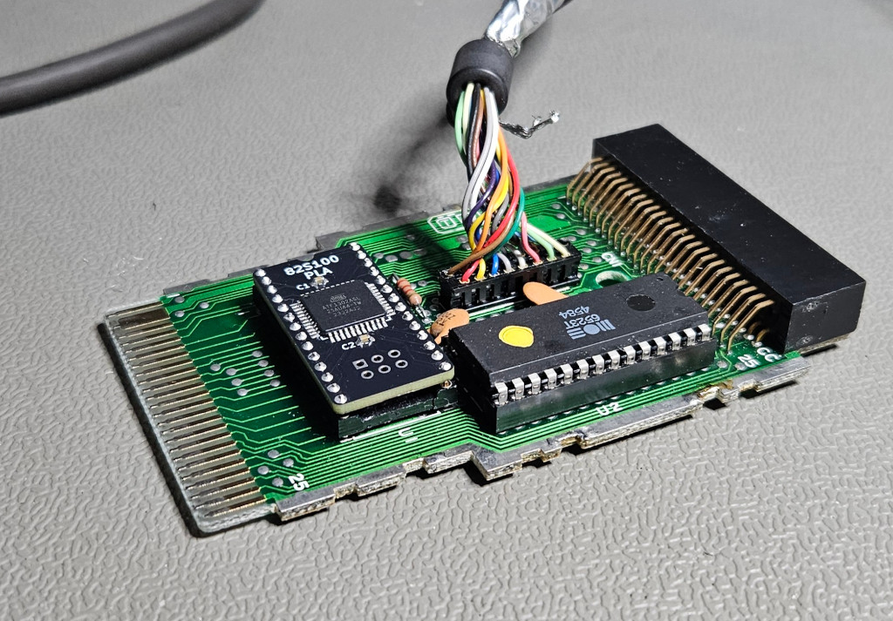

## PLA replacement for Commodore 1551 paddle

This replaces the original MOS part with number 251641-03

The equations.ods spreadsheet is an overview of the input states utilized for the three outputs. 
F1 isn't connected to anything and isn't needed as far as I can tell but I kept it anyway.

I based the equations on the complete thruth table in the truthtable.ods spreadsheet which I created from the PLA dump that is used by EPROM PLAs.
I rearranged the bits again to make it easier to read.

Source code and binaries are in the PLD folder.