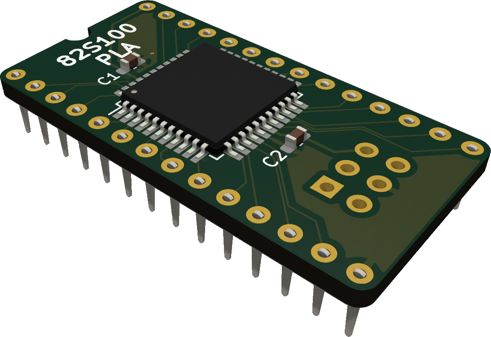
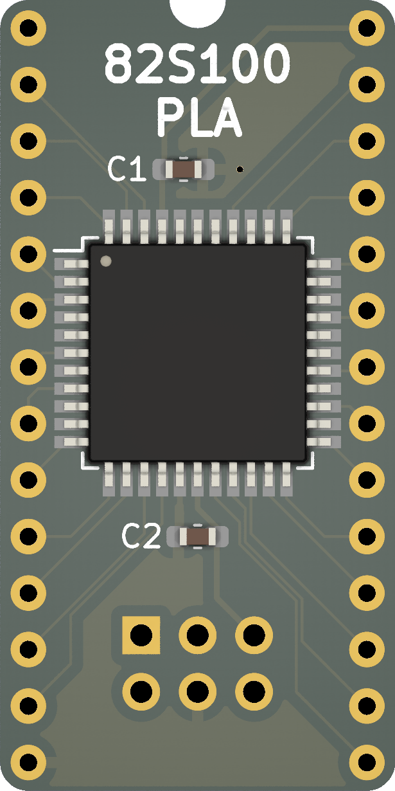
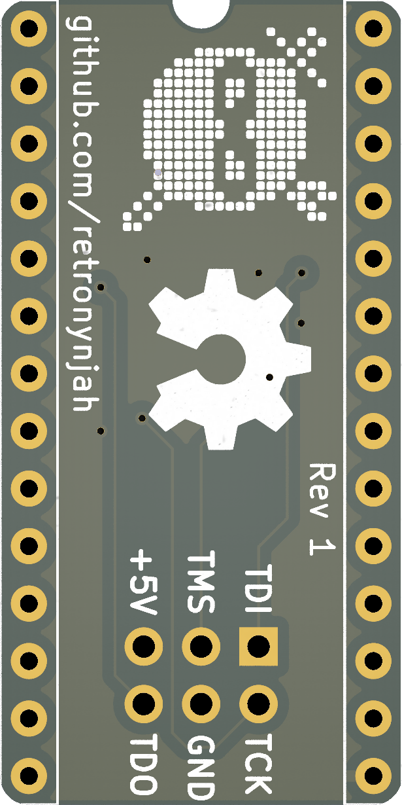

# 82S100 PLD based PLA replacement

This replacement is a remix of [an old design by Mattis Lind](https://github.com/MattisLind/82S100replacement) based on the ATF1502 and compatible PLDs.  
I'm using the same pinout so my board can be used with MattisLind's C64 PLA code without modification.

I have also created code for the PLA Commodore Plus/4 and the Commodore 1551 disk drive.  
I'm far from an expert at CUPL and logic equations so there's likely room for improvement. You are welcome to help out if you can.

The parts count is low: One ATF1502 PLD (TQFP-44), two 100nF caps (0603) and suitable pin headers.
I prefer flat pins (Arduino stackable headers) or SIL contact strips like [TE 1544210-2](https://www.digikey.se/short/f8hvfqzt) for a number of reason. They give a much lower profile, they stick better to sockets than round machined pins do and they are not as fragile as machined pins.  
The low profile is ideal for the Plus/4 and the 1551 paddle PLA.  
The PLD I've been using is ATF1502ASL-25AU44. It's possible that other varations may work too but it needs to be a 5V part.

  
