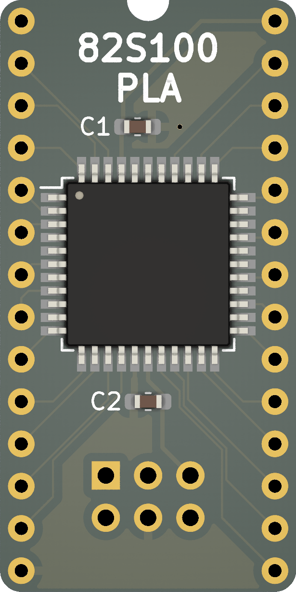
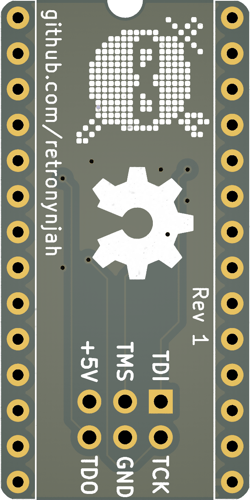
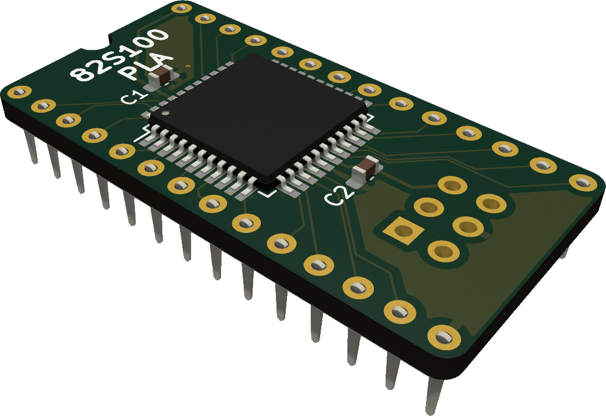
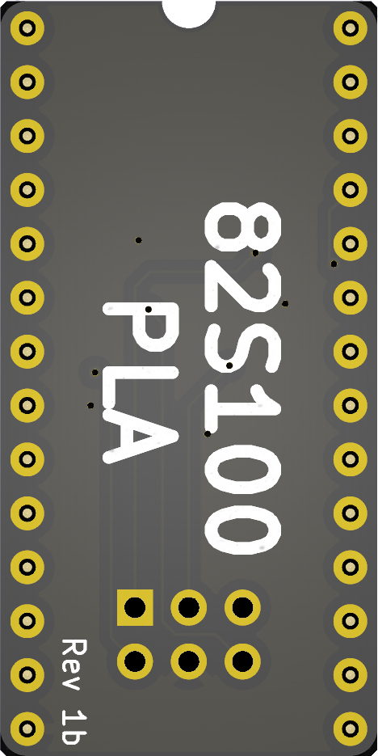
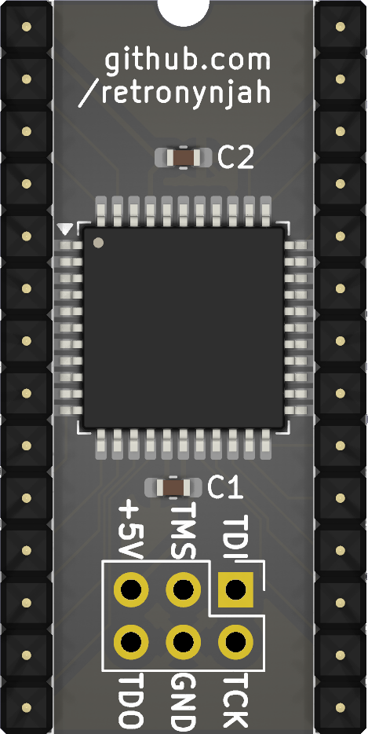
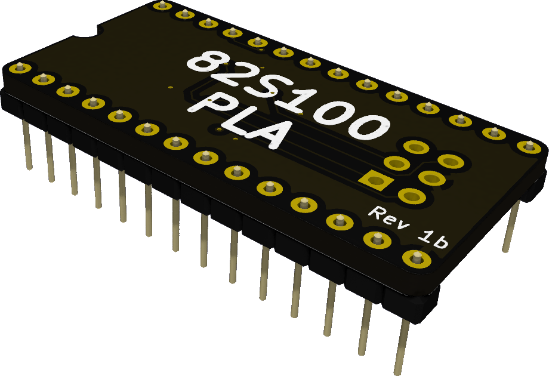

# 82S100 CPLD based PLA replacement
This replacement is a remix of [an old design by Mattis Lind](https://github.com/MattisLind/82S100replacement) based on the ATF1502 and compatible PLDs.  
Revision 1 of the board uses the same pinout so my board can be used with MattisLind's C64 PLA code without modification.
Revision 1b is reverted. The parts are on the back side giving the PLA a cleaner look. Because it's inverted, the pinout of the CPLD is different and it needs different code. Grab code for the right PCB!  

## Code
I have made minor adjustments to Mattis's code to enable the CE pin. The CE pin is grounded in all Commodore machines but this makes the PLA match the original better when tested in chip testers that test the CE pin.
The code is written in CUPL. PLD, JED and SVF files are available in the hdl folder for each board revision.
I have created PLA code for the below models
|Model         |Part number |
|:----------    |:----------  |
|C64           |906114-01   |
|CBM-II HP     |906114-05   |
|C16 & Plus/4  |251641-02   |
|CBM 1551      |251641-03   |

## Programming
The CPLD is programmed using JTAG. I'm writing the with svf files using OpenOCD and a FT232H USB breakout board.  
Just be sure to grab the right svf file for your pcb revision.

## Testing
I have custom logic device definitions for Xgpro for the Minipro TL866-II and T48. Those can be used to verify that you have written the correct file and that the PCB is soldered correctly.

## BOM
The part count is low: One ATF1502 CPLD, two 100nF caps (0603) and suitable pin headers.
For rev 1, I prefer flat pins (Arduino stackable headers) or SIL contact strips like [TE 1544210-2](https://www.digikey.se/short/f8hvfqzt) for a number of reason. They give a much lower profile, they stick better to sockets than round machined pins do and they are not as fragile as machined pins. The low profile is ideal for the Plus/4 and the 1551 paddle PLA.  
For rev 1b, machined pins are better as the components are mounted on the back side and the machined headers adds the necessary clearance.  

The CPLD I've been using and recommend is ATF1502ASL-25AU44. It's possible that other varations may work too but it needs to be a 5V part. The 10ns version is causing glitches when used for a C64 PLA.

## Rev 1
    
  
## Rev 1b
    
  
