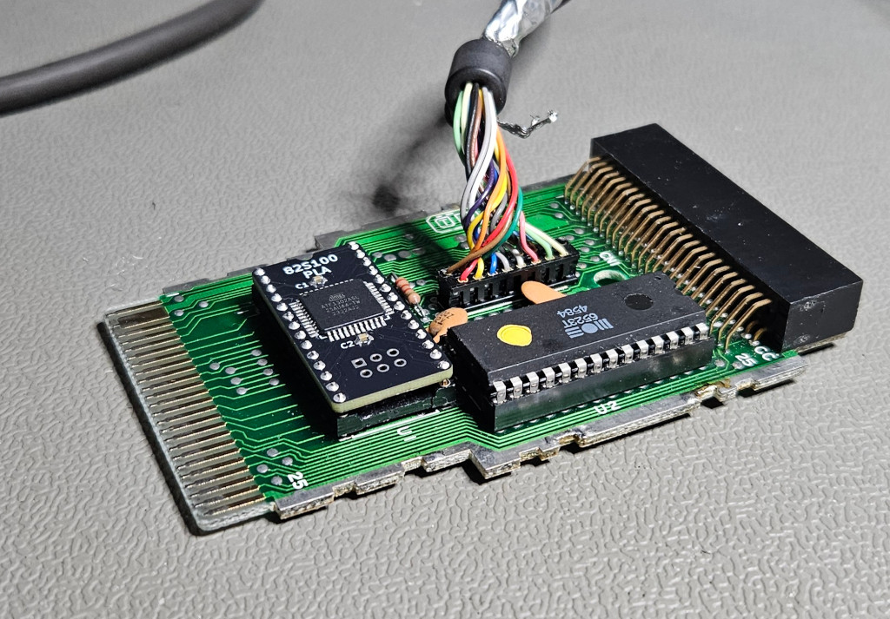

## PLA replacement for Commodore 1551 paddle

This replaces the original MOS part with number 251641-03

F1 isn't connected to anything and isn't needed as far as I can tell but I kept it anyway.
Source code and binaries are in the PLD folder.

I recommend a Rev 1 board with low profile pin headers for the 1551 to make it fit inside the paddle